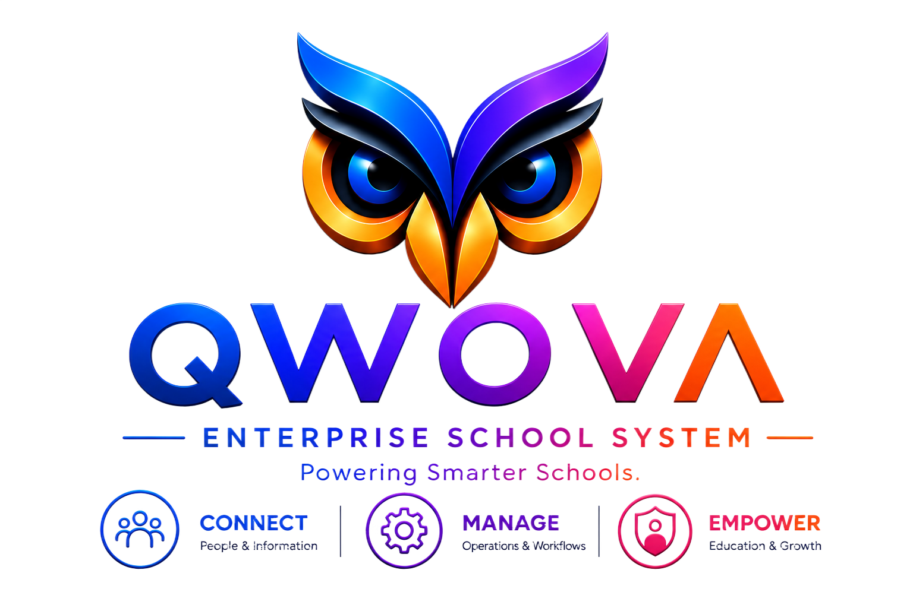

# Qwova
Qwova™ — Cloud-based Education Management System

# Qwova™
**Cloud‑based Education Management System**

Qwova is an intelligent school ERP platform currently in development.  
The name *Qwova* means "many systems woven together," from the English root *woven* -(wova).

**First use in commerce:** 17 July 2026  
**Founder:** Dennis Mucia  
**Country:** Kenya  
**AI Assistant:** Qilva™  

© 2026 Qwova. All rights reserved. ™
